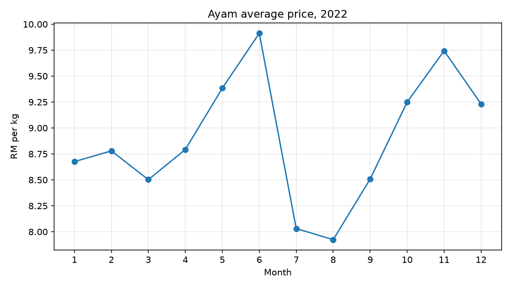
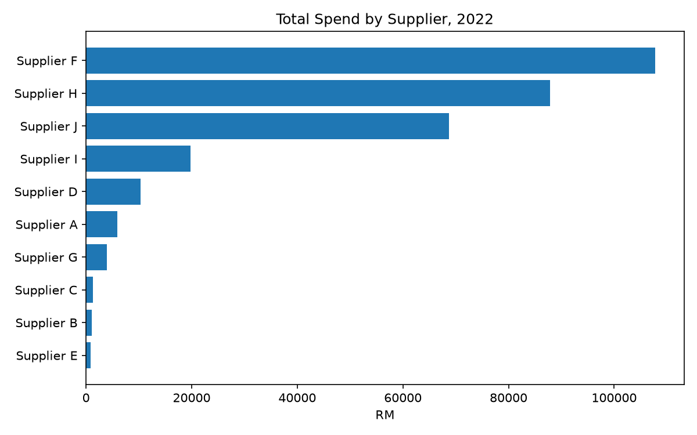
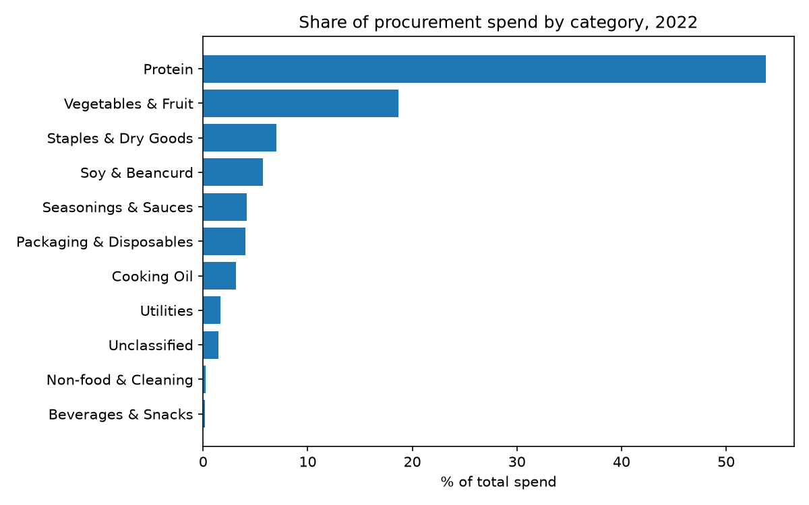
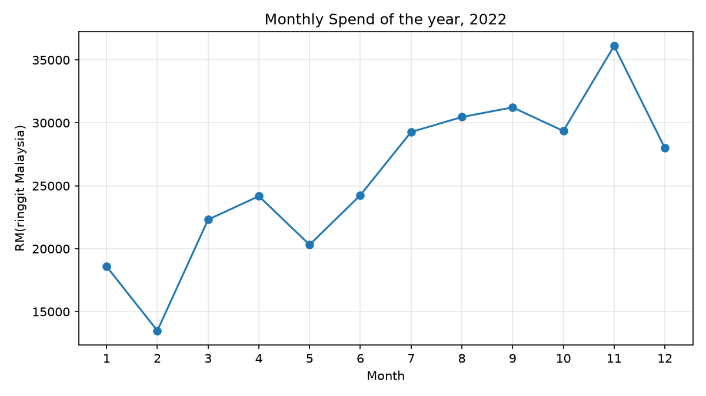
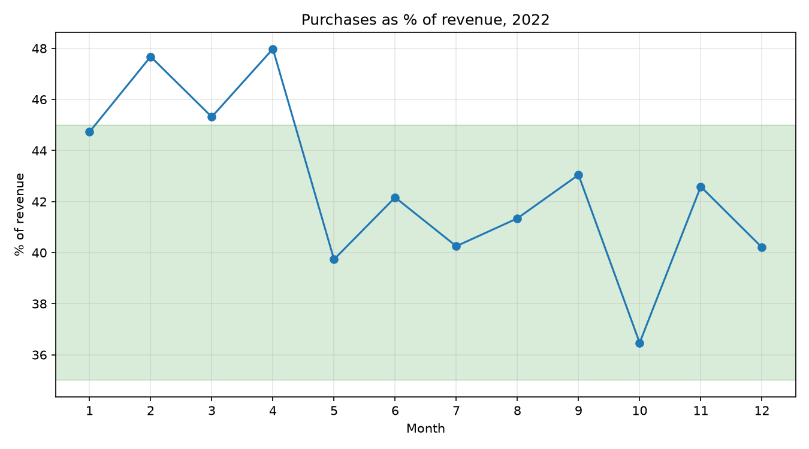

# Procurement Analytics for a Malaysian Restaurant, 2022

Twelve months of hand-kept purchase records from a family-run restaurant in Johor,
Malaysia, parsed into a tidy dataset and analysed to answer one question: how did a
small F&B business hold its cost structure through the food-inflation year of 2022?

**Data:** 7,114 purchase records · 354 items · 10 suppliers · Jan–Dec 2022

**Stack:** Python (pandas, matplotlib) · SQLite · LLM-assisted text classification

> Supplier names are anonymised and revenue appears only as ratios. The underlying
> figures are not published.

## Interactive Dashboard

**[View the live dashboard on Tableau Public →](https://public.tableau.com/app/profile/yao.lew/viz/RestaurantProcurementAnalytics2022/Dashboard1)**

Four linked views built on the cleaned 2022 dataset:

- **Monthly Spend** — procurement spend by month as a share of the annual total
- **Supplier Concentration** — the top three suppliers account for ~86% of spend
- **Top 10 Items by Spend** — pork shoulder alone is ~29%, chicken ~15%
- **Spend Heatmap** — supplier activity across all twelve months, exposing mid-year onboarding and sourcing gaps

Click any supplier bar to filter all four views simultaneously.

All values are expressed as shares of total spend. Absolute figures are withheld
for confidentiality. Source data is produced by `parse_kmyh.py` in this repo.

---

## 1. Why this project

I helped run this restaurant with my family, and these are the books I kept myself. In
2022 I recorded every purchase so that the business could be managed with measurement
rather than intuition — we had a feel for our costs from experience, but no evidence.

This project revisits that year with the analytical tools I have learned since. The
question I wanted to answer was where our profitability actually stood, and whether the
cost discipline we believed we had could be demonstrated from the records rather than
asserted from memory.

---

## 2. The data

The source was twelve Excel workbooks, one per month, each holding a sheet per
supplier. Every sheet is a wide grid: one row block per item (quantity, total price,
unit price) against one column per calendar day.

Turning that into an analysable table required reshaping each grid from wide to long,
then pivoting the three measures back into columns — producing one row per item, per
supplier, per day.

| Field | Description |
|---|---|
| date | Purchase date |
| supplier | Vendor (anonymised in the public dataset) |
| item | Free-text item name, mixed English / Malay / Chinese |
| unit | kg, packet, bottle, piece |
| quantity | Amount purchased |
| total_price | Amount paid |
| unit_price | Recomputed as total_price ÷ quantity |

---

## 3. Data quality work

Real books are messy in ways that teaching datasets are not. Six issues were found and
resolved before any analysis:

| Issue | Detection | Resolution |
|---|---|---|
| Two quantity-recording errors | Unit price exceeded RM12/kg against a ~RM9 norm | Corrected from operator knowledge, validated against the monthly price range, encoded in the pipeline |
| Excel lock file crashing the parser | Pipeline output never changed after edits | Filter added for `~$` and `._` temporary files |
| A duplicate, partial source workbook | Purchase-to-revenue ratio fell to 20% in one month — operationally impossible | Replaced with the complete workbook; every downstream chart regenerated automatically |
| Subtotal rows mixed in with line items | Coverage check surfaced 31 rows with no item name | Excluded at parse time; they would have double-counted spend |
| One supplier split by capitalisation | Two bars for the same vendor | Whitespace and case normalisation |
| Encoding corruption of a lookup file | `UnicodeDecodeError` on Chinese item names | Standardised on UTF-8 |

Two of these — the partial workbook and the subtotal rows — produced results that looked
plausible rather than obviously wrong. Both were caught by cross-checking against a
second source or against operational knowledge, not by the code failing.

---

## 4. Findings

### 4.1 Chicken prices tracked national policy, not just global inflation



Chicken was the single largest line item of the year, and its price moved with
government intervention almost month for month.

Prices sat at RM8.40–8.80/kg through the first quarter, just under the RM8.90 ceiling
that Malaysia imposed from 5 February to 30 June 2022. Costs rose through May to a June
peak of RM9.91 as shortages worsened and an export ban took effect on 1 June. After the
ceiling was lifted on 1 July, prices fell to the year's low of RM7.92 in August, a
period when oversupply had emerged. They climbed again to RM9.74 in November, following
the full lifting of the export ban in October.

The background driver was the global cost surge that followed the Russo-Ukrainian war,
compounded domestically by disease and weather. But the shape of the curve is policy,
not war.

The durable finding is the floor rather than the peak: December closed at roughly
RM9.30/kg, about **6% above January**. The mid-year spike was temporary; the reset was
permanent.

### 4.2 Spend is heavily concentrated in three suppliers



The top three suppliers account for roughly 85% of purchases.

Two reasons. First, location — these vendors were close enough to make daily
procurement practical. Second, category structure: they supplied the items that make up
the largest share of cost, so concentration in spend followed concentration in need.

To manage the dependency, we approached suppliers across several states and negotiated
using our own purchase data and actual demand volumes. That produced both price
competition and a substitution route during shortages.

### 4.3 Protein is over half of all procurement spend



Item names alone could not answer this. The same category appeared as `Ayam`, `前上`,
`肉片`, `肉碎` and dozens of other labels across three languages. An LLM was used to
resolve 354 free-text names into an 11-category taxonomy, joined back with a left join
and a coverage check (zero unmatched rows).

Protein accounts for roughly 54% of spend and vegetables 19%. This was the most useful
correction to my own assumptions: from experience I had estimated protein at around 70%
of cost. It is the largest category by a wide margin, but not to the degree I believed —
and the gap between a practitioner's estimate and the measured figure is precisely the
value of keeping records.

It also explains the concentration in 4.2: the largest vendor is largest because the
largest category is.

### 4.4 Procurement grew with the business



Monthly purchasing roughly doubled across the year, driven by rising volume as the
business grew. February is the exception, reflecting the Chinese New Year closure.

Note that this series covers supplier purchases only. Wages and other operating costs
were recorded separately and are outside the scope of this dataset.

### 4.5 Cost ratio held inside the target band



Purchases ran at **42% of revenue for the full year**. January to April sat at the top
of the 35–45% target band or above it, peaking at 48%. From May onward the ratio stayed
inside the band for eight consecutive months, closing the year at 40%.

The change was a price increase in April–May, introduced alongside improvements to
service and product quality. The mechanism matters: over that window revenue grew faster
than procurement spend, so the ratio improved through the denominator rather than
through cost reduction. In other words, the margin gain came from pricing power, not
from buying more cheaply — which is the harder of the two to achieve during an
inflationary year.

---

## 5. Limitations

- Procurement spend is not the same as consumption. Bulk buying and stock timing shift
  money between months.
- Around a quarter of spend sits under catch-all supplier labels rather than named
  vendors.
- Revenue is available monthly only, so no analysis below month level is possible.
- Wages and other operating expenses are outside this dataset, so the ratios here are
  procurement-to-revenue, not full gross margin.
- The analysis covers 2022 alone. Detailed record-keeping stopped after that year.

---

## 6. Reproducing this

```bash
pip install pandas openpyxl matplotlib
python3 parse_kmyh.py        # workbooks -> tidy CSV
python3 chart_ayam_price.py
python3 chart_suppliers.py
python3 chart_monthly_spend.py
python3 chart_cogs_ratio.py
python3 chart_categories.py
```

All cleaning rules and corrections live in `parse_kmyh.py`. No figures were edited by
hand at any stage, so correcting a source file regenerates every output.

---

## 7. What I would do next

The most useful finding is not in the charts: the business stopped recording at this
level of detail after 2022, which means it lost the visibility this analysis depends on.

- Rebuild a lightweight tracking system — a fixed template or simple app that captures
  purchases as they happen, rather than reconstructing them later
- Capture item-level sales alongside purchases, so dish-level margin becomes measurable
- Derive reorder points from purchase frequency to reduce stockouts and over-ordering
- Re-run this analysis annually, so the cost ratio is monitored rather than discovered
